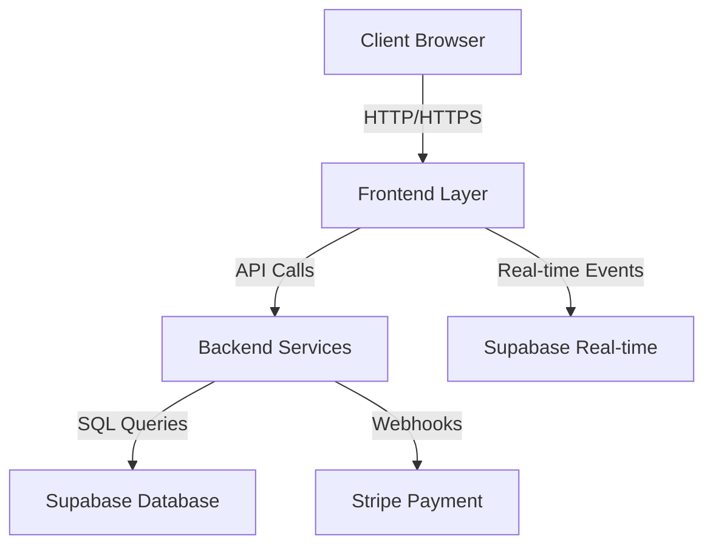
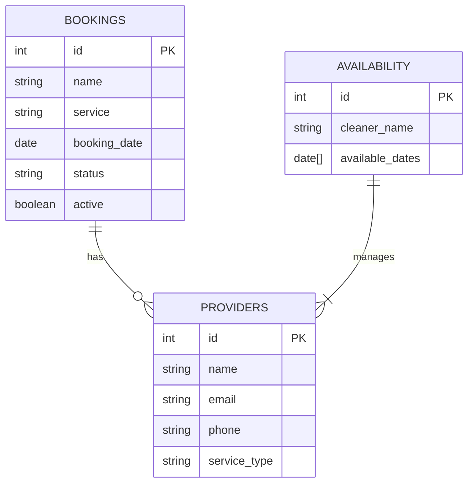

# Design Documentation

## Overview
MyClean's architecture was designed with scalability, maintainability, and user experience as core principles. Our design choices reflect modern web development practices while ensuring robust functionality.

## Architectural Design

### System Architecture


### Component Architecture
1. **Frontend Layer**
   - HTML5/CSS3 for structure and styling
   - Vanilla JavaScript for interactivity
   - Module-based architecture for code organization
   - Real-time updates via Supabase subscriptions

2. **Backend Services**
   - Serverless architecture using Supabase
   - RESTful API endpoints for CRUD operations
   - Real-time data synchronization
   - Authentication and authorization

3. **Database Layer**
   - PostgreSQL with Supabase extensions
   - Real-time capabilities
   - Row-level security policies
   - Automated backup systems

## Database Design

### Entity Relationship Diagram


### Database Justification
1. **Schema Design**
   - Normalized to 3NF to prevent data redundancy
   - Optimized for common query patterns
   - Indexes on frequently accessed columns

2. **Data Types**
   - UUID for primary keys
   - JSONB for flexible data storage
   - Array types for date collections
   - Timestamps with timezone

3. **Security**
   - Row Level Security (RLS) policies
   - Role-based access control
   - Encrypted sensitive data

## User Interface Design

### Design System
1. **Color Palette**
   ```css
   :root {
     --primary-color: #3a86ff;
     --secondary-color: #00c2a8;
     --background-light: #f8f9fa;
     --text-dark: #212529;
   }
   ```

2. **Typography**
   - Primary: Inter font family
   - Secondary: System fonts
   - Responsive scaling

3. **Components**
   - Modular card system
   - Consistent form elements
   - Responsive grid layout
   - Interactive data tables

### Key Interface Flows

1. **Booking Flow**
   ```mermaid
   sequenceDiagram
       Customer->>+Booking Form: Fill Details
       Booking Form->>+Availability Check: Validate Date
       Availability Check->>+Payment: Process
       Payment->>+Confirmation: Success
   ```

2. **Provider Management**
   ```mermaid
   sequenceDiagram
       Admin->>+Provider List: View
       Admin->>+Add Provider: Create
       Add Provider->>+Validation: Check
       Validation->>+Database: Save
   ```

### Mockup Wireframe
- Ninjamock: https://ninjamock.com/s/H16S5Lx

### Responsive Design
- Mobile-first approach
- Breakpoints at 768px and 1024px
- Fluid typography
- Flexible grid system

## Design Iterations

### Iteration 1 (February - March)
- Implemented core booking system
- Basic provider management
- Fundamental database structure
- Essential UI components

### Iteration 2 (March - April)
- Enhanced real-time capabilities
- Advanced analytics dashboard
- Refined user interfaces
- Payment integration
- Improved error handling

## Design Decisions & Justification

### Architecture Choices
1. **Supabase Selection**
   - Real-time capabilities
   - Built-in authentication
   - PostgreSQL support
   - Cost-effective scaling

2. **Frontend Approach**
   - Vanilla JS for minimal overhead
   - Module pattern for maintainability
   - Progressive enhancement

### Testing Considerations
- Component isolation
- End-to-end flow testing
- Performance monitoring
- Security auditing

## Future Design Considerations
1. **Scalability**
   - Microservices architecture
   - Caching layer
   - Load balancing

2. **Features**
   - Mobile applications
   - Advanced analytics
   - AI-powered scheduling
   - Multi-language support

## Conclusion
Our design approach prioritized:
1. User experience through intuitive interfaces
2. System reliability via robust architecture
3. Data integrity with proper database design
4. Future scalability through modern practices